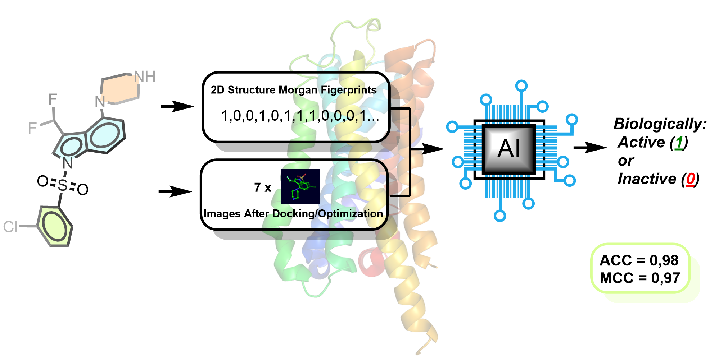

# fCNN – Multimodal Neural Network Bioactivity Classifier

This repository presents the project **"fCNN – multimodal neural network bioactivity classifier, based on Morgan fingerprints and images of simulated (Docking, DFT) molecules."**

As part of this work, we developed a multimodal ligand bioactivity classifier targeting the 5-HT6 receptor. The model combines two types of molecular representations: Morgan fingerprints and images of ligands generated after simulation with **Maestro Schrödinger** (docking and DFT geometry optimization).  
This hybrid approach combines the predictive strength of fingerprints with the resistance to overfitting provided by using images, resulting in a more robust binary classifier that performs well even on relatively small datasets

To allow users to run the model locally, we provide a script that launches one of the four delivered pre-trained models.  
Additionally, we offer a **plugin for Maestro Schrödinger** to automate the process of selecting molecules and generating screenshots for dataset collecting.

---

## 📁 Repository Contents

- **Compatibility_versions.md** — describes compatible versions of required libraries/frameworks  
- **ChEMBL_Parser.ipynb** — notebook for parsing ligands from the ChEMBL database  
- **Spreadsheet_script.ipynb** — script that generates a `.csv` file containing the "Entry ID" of the best-scoring conformer (based on "Docking Score" or "State Penalty") per ligand, from selected structures within Workspace Navigator in Maestro (select            ligands in Workspace Navigator, click right nouse button and select "Export"==>"Spreadsheet". Subsequently select desired properties ("Entry ID" and "Docking Score" or "State Penalty" and save))
- **Screenshots_plugins_for_Maestro** — folder containing plugins for Maestro (**Entry_selector.py**, **Screenshots_capturing_script.py**) that automates molecule selection and screenshots capturing  
- **fCNN_launching_dir/** — directory containing example files (images and SMILES of two example ligands)  
- **CNN_notebook.ipynb** — notebook implementing the CNN-based model (only images)  
- **Fingerprints_notebook.ipynb** — notebook implementing the fingerprint-based model (only fingerprints)
- **fCNN_MultiModal_Classifier.ipynb** — notebook combining both modalities (fingerprints + images)  
- **fCNN_launcher.ipynb** — script for launching the trained model on new data

---

## 🧪 Manual

### a) Installing and Running the Maestro Plugins

1. In Maestro, go to the **Scripts** tab and choose **Install**
2. Select the folder containing the plugins, confirm installation (install both scripts)
3. After installation, the plugins will be visible in the Scripts panel  
   Short description:
   - **Entry_selector.py** – selects conformers with the lowest "Docking Score" or "State Penalty". Requires a `.csv` file containing the "Entry ID" values for the best conformer per each ligand
      (generated using **Spreadsheet_script.ipynb**)
   - **Screenshots_capturing_script.py** – generates molecules images (screenshots)
     **NOTE:**
     The scripts need hardcoded paths to the CSV file with "Entry_Id" (for Entry_selector.py) and to the folder where the screenshots will be saved (for Screenshots_capturing_script.py). Due to the lack of a GUI, any path changes must be made directly in the        code, and the script must be reinstalled (install as described above).

### b) Running the Classifier

To use the `fCNN_launcher.ipynb` script:

1. Place the `fCNN_launcher.ipynb` notebook in the same folder as:
   - The `.joblib` file (a trained model)
   - A `.csv` file containing SMILES strings of the compounds to classify
2. In cell 5 of the notebook (the image loading step), provide the path to the folder containing subfolders with molecule images (see comment within notebook in this cell)

---

## 🔗 Download Trained Models and Datasets

The following models and datasets are too large for GitHub (>50MB), so we provide them via **Google Drive**.  
> Content:
- [`CNN_docking_model_with_fps_architecture_I.joblib`]
- [`CNN_quanta_model_with_fps_architecture_I.joblib`]
- [`CNN_docking_model_with_fps_architecture_II.joblib`]
- [`CNN_quanta_model_with_fps_architecture_II.joblib`]
- [`images_docking_dataset`]
- [`images_dft_dataset`]   
---

## 📌 Notes

- The plugin and models were tested with specific versions of Maestro and Python packages. See `Compatibility_versions.txt` for more details.
- The example files provided in `fCNN_launching_dir/` can be used to test the pipeline end-to-end.
